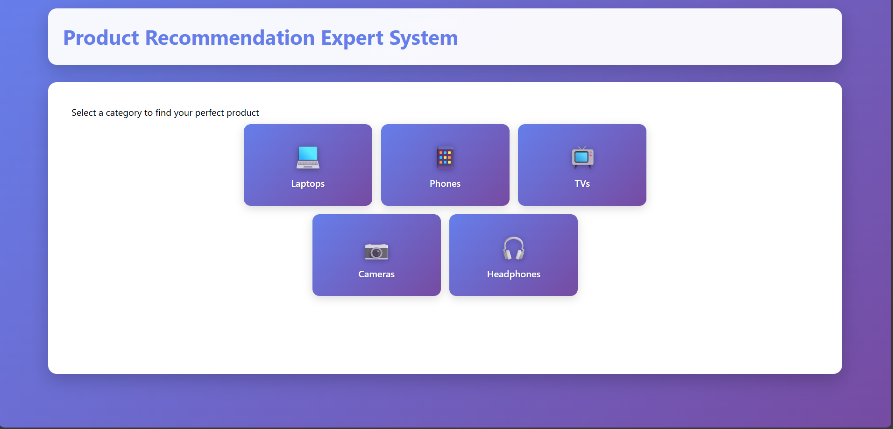
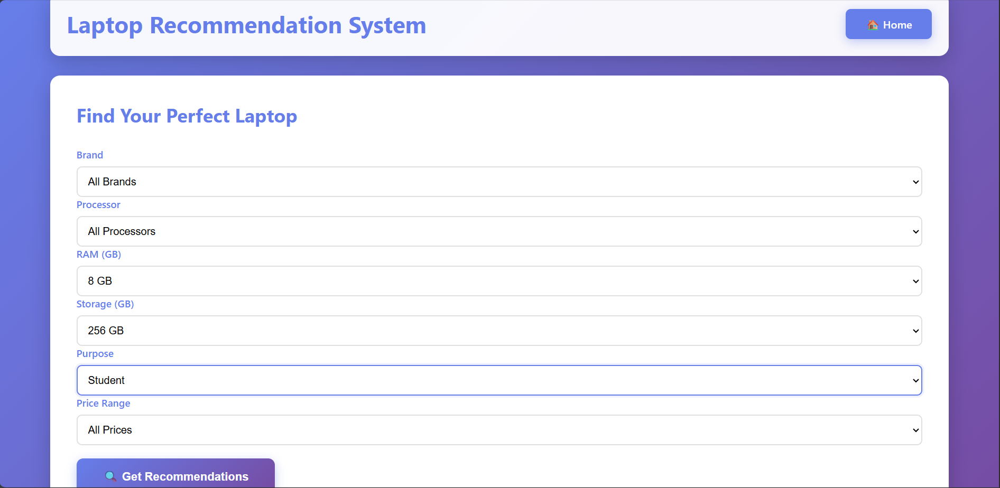
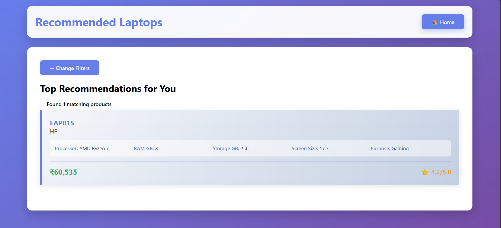

# Product Recommendation Expert System

A FastAPI-based expert system that recommends the best products
(Laptops, Phones, TVs, Cameras, Headphones) based on user-selected
filters such as brand, price range, and category.\
The system generates synthetic datasets (500+ entries per category) and
provides filtered recommendations through a clean and responsive HTML
interface.

------------------------------------------------------------------------

## 🚀 Features

-   ✔ Automatic dataset generation using **NumPy & Pandas**\
-   ✔ Category-wise product recommendation (Laptop, Phone, TV, Camera,
    Headphones)\
-   ✔ Fast API backend with Jinja2 HTML templates\
-   ✔ API + Web UI for searching products\
-   ✔ Clean and responsive interface\
-   ✔ Supports brand filtering, price filtering, and multi-category
    filtering

------------------------------------------------------------------------

## 🗂 Project Structure

    /project-root
    │── main.py                 # FastAPI backend
    │── product_generation.py   # Synthetic dataset generator
    │── templates/
    │     ├── index.html        # Home page
    │     ├── laptops.html      # Laptops page
    │     ├── phones.html       # Phones page
    │     ├── tvs.html          # TVs page
    │     ├── cameras.html      # Cameras page
    │     └── headphones.html   # Headphones page
    │── static/
    │     └── styles.css        # Styling
    │── README.md               # Project documentation

------------------------------------------------------------------------

## ⚙️ Installation & Run

### **1. Install Dependencies**

``` bash
pip install fastapi uvicorn numpy pandas jinja2
```

### **2. Run the FastAPI Server**

``` bash
uvicorn main:app --reload
```

### **3. Open in Browser**

    http://127.0.0.1:8000

------------------------------------------------------------------------

## 📌 How It Works

1.  `product_generation.py` creates large synthetic datasets\
2.  User selects category → brand → price\
3.  Backend filters products and renders a clean HTML result\
4.  FastAPI automatically serves pages using templates

------------------------------------------------------------------------

## 📸 Screenshots 

  Home Page     
  Selection Page  
  Recommendation Page   

------------------------------------------------------------------------

## 🛠 Tech Stack

-   **FastAPI**
-   **HTML + CSS (Jinja2 Templates)**
-   **Python (NumPy, Pandas)**
-   **Uvicorn Server**

------------------------------------------------------------------------

## 👤 Author

**Piyush Ranjan**\
*Developer -- AI & Python Enthusiast*

------------------------------------------------------------------------

## 📄 License

This project is licensed under the **MIT License**.
